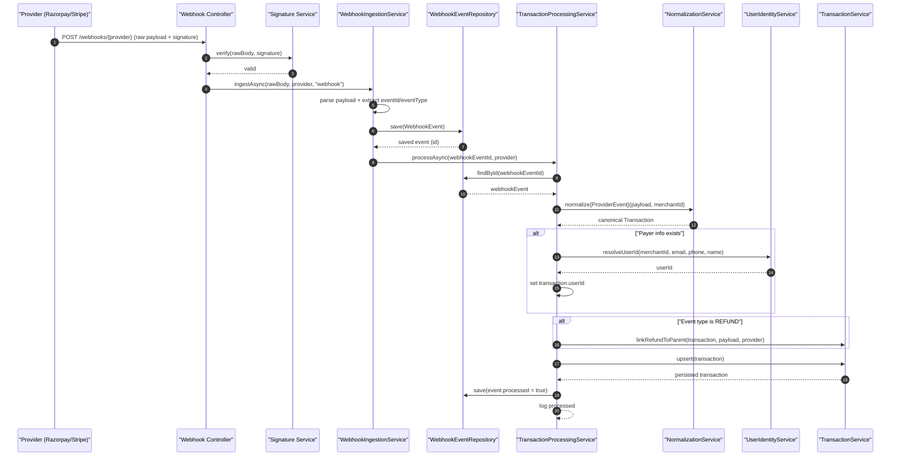
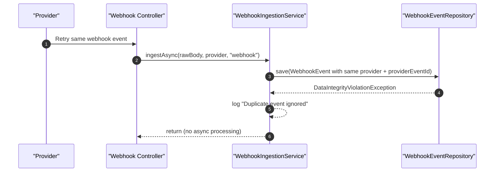
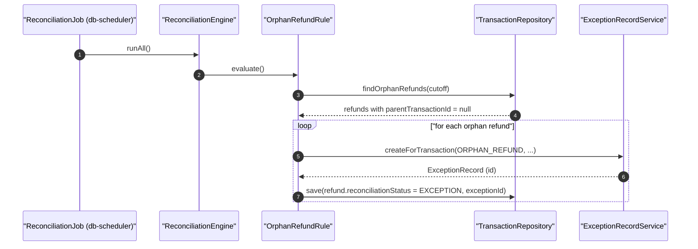
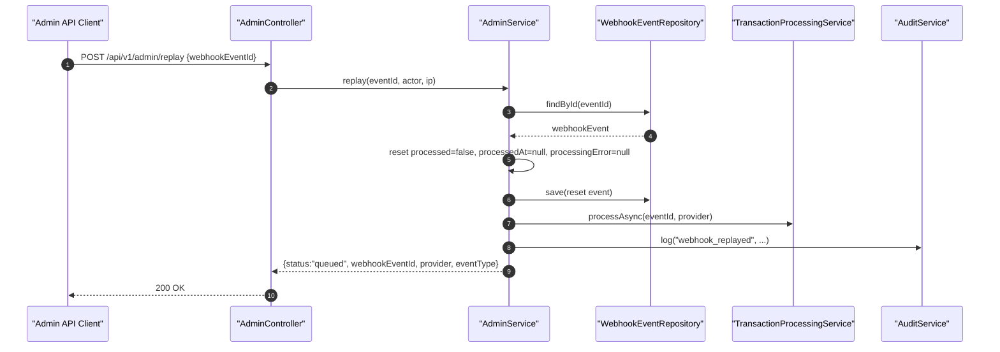
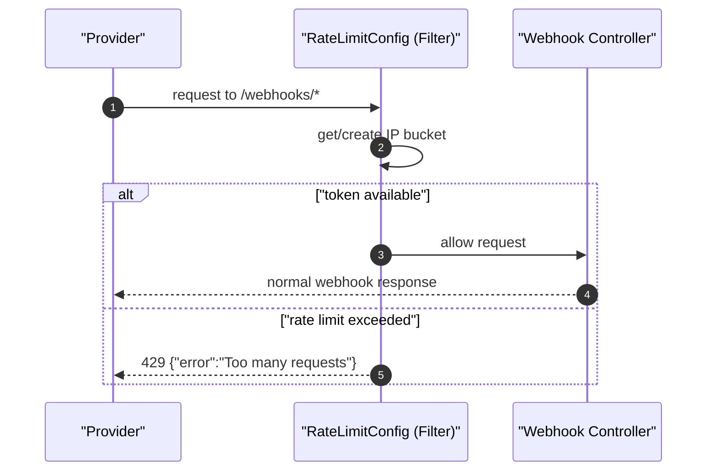

# Reconciliation Platform: Visual Flow Diagrams

This companion file provides Mermaid sequence diagrams for the most important runtime paths.

## 1) Webhook Success Path

## 2) Duplicate Webhook Path (Idempotency)

## 3) Refund Orphan Detection Path

## 4) Admin Replay Flow

## 5) Optional: Rate-Limit Protection for Webhooks

---

If you want next, I can add one more diagram for `TransactionService.upsert(...)` showing the out-of-order timestamp guard branch in detail.
