# Reconciliation Platform Visual Diagrams

## System Architecture

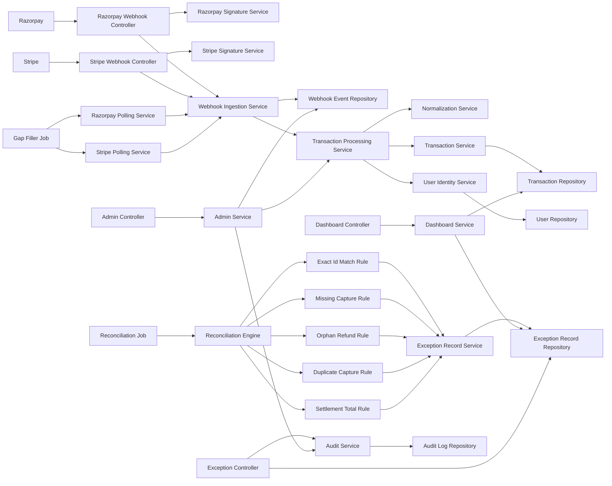

## Request Security Chain

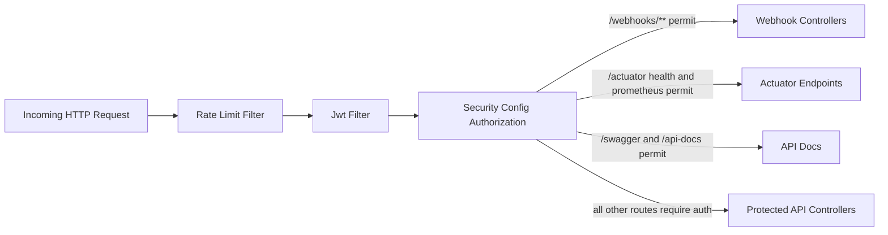

## Webhook Success Flow

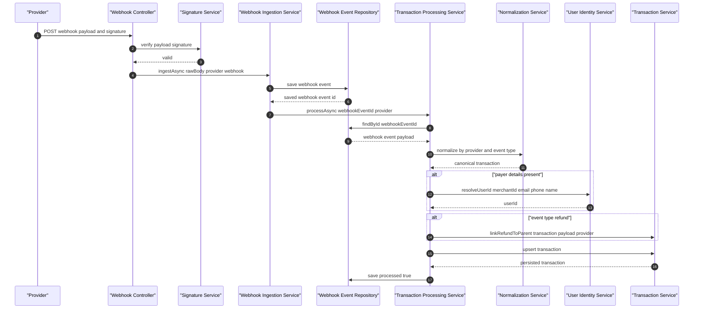

## Duplicate Webhook Flow

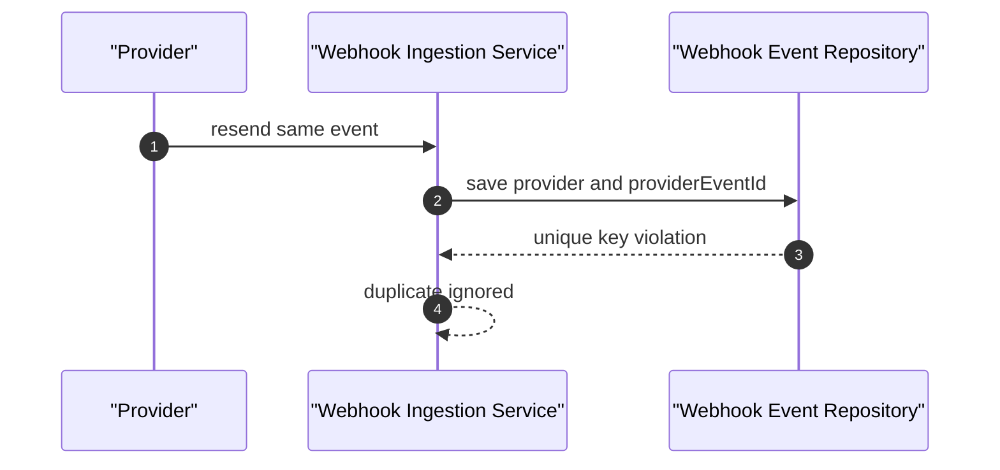

## Processing Error Flow

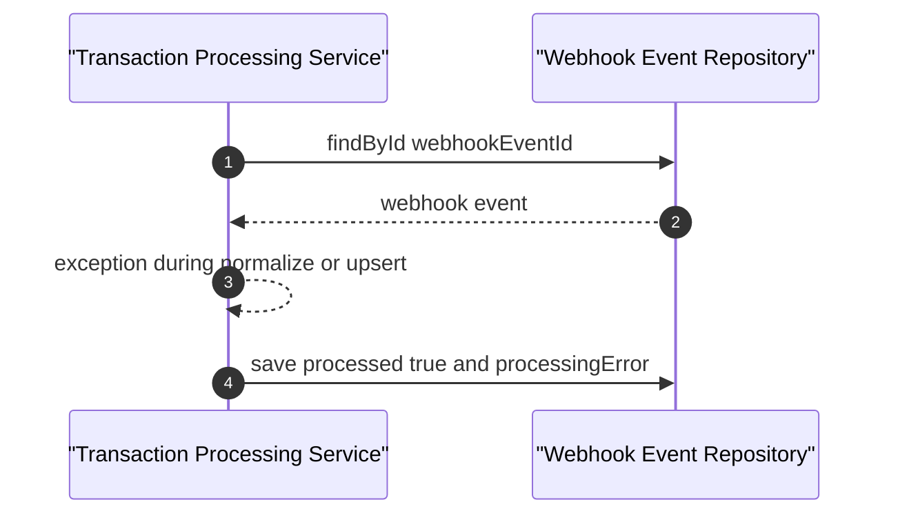

## Transaction Upsert Decision

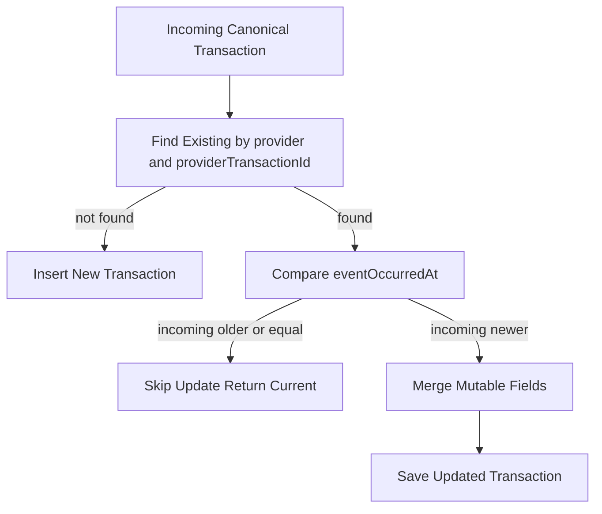

## Reconciliation Engine Run

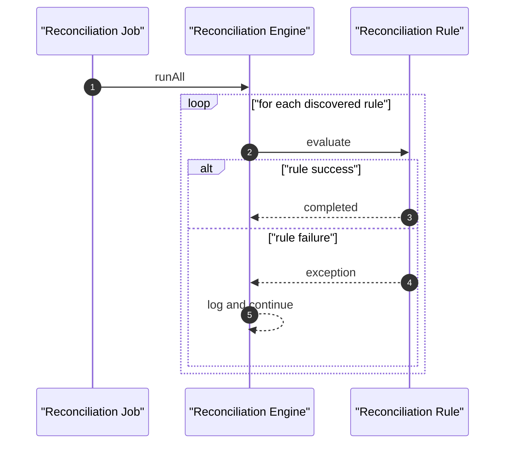

## Rule Outcome Pattern

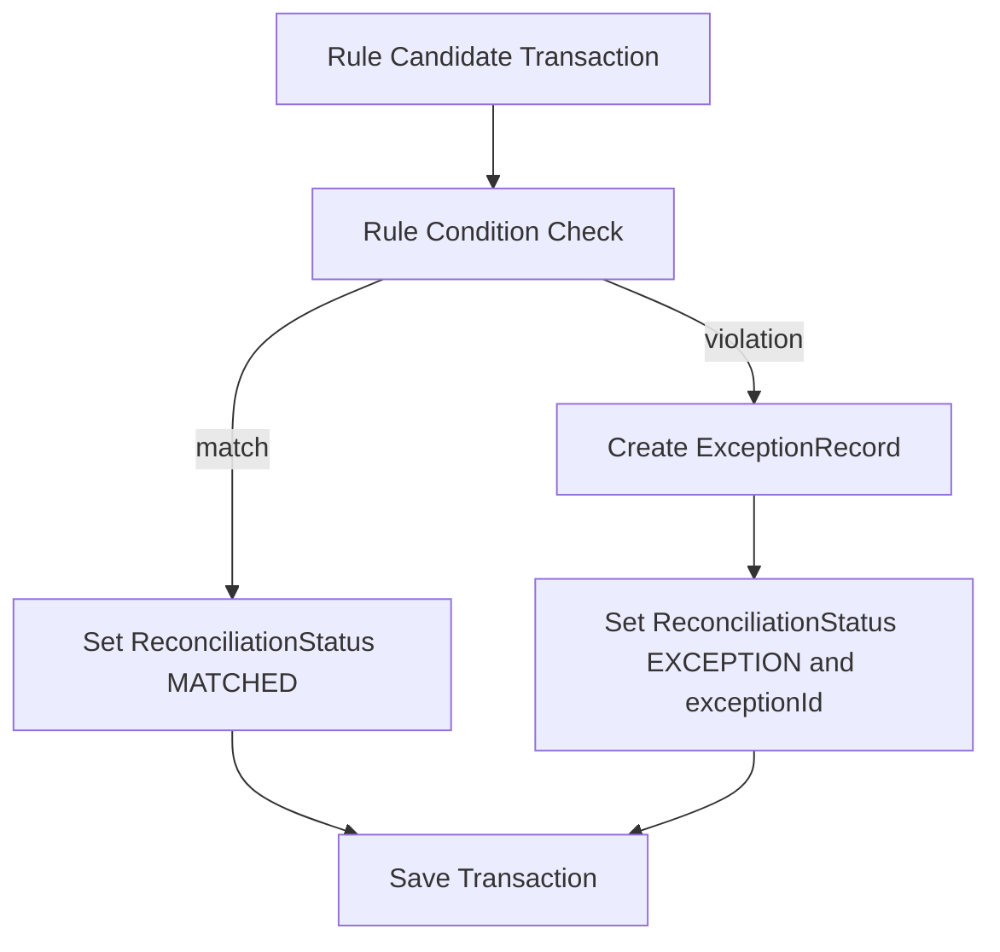

## Exception Lifecycle

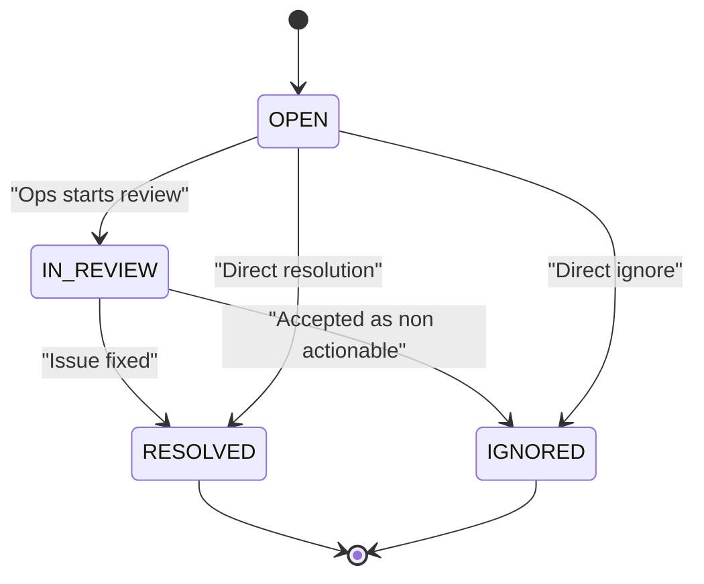

## Admin Replay Flow

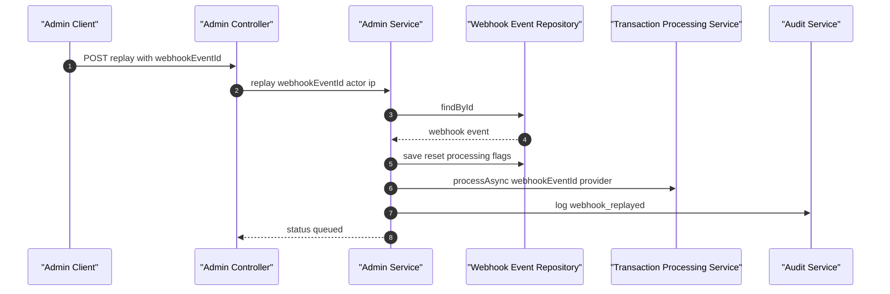

## Gap Filler Flow

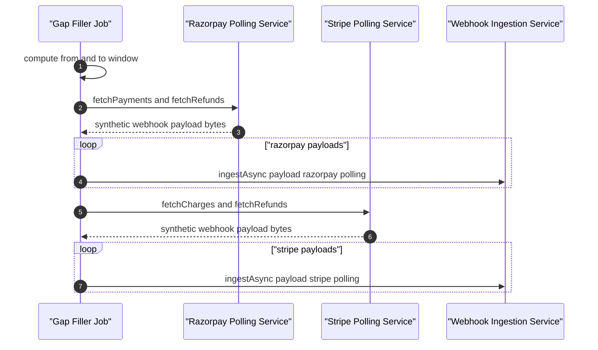

## Dashboard Metrics Flow

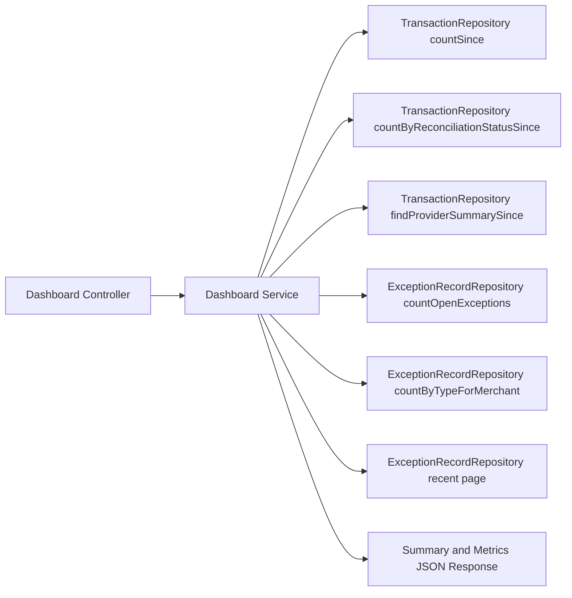

## Data Model Relationships

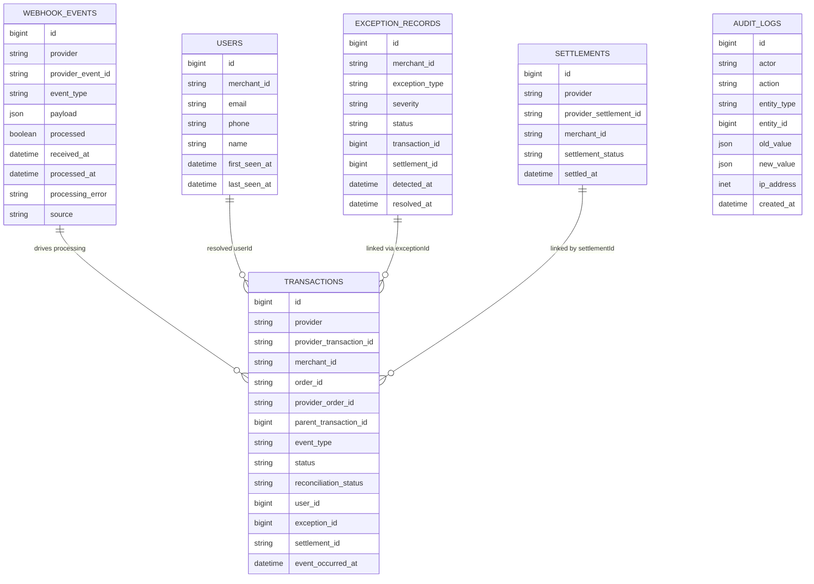

## Operational Views

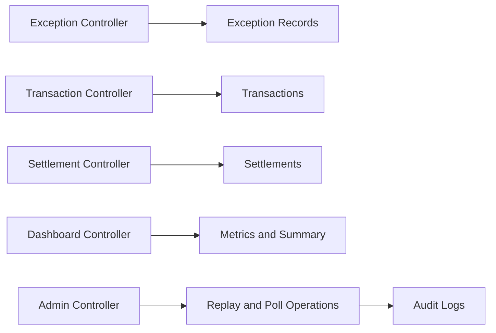
